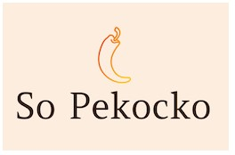

#  OpenClassrooms-Développeur Web

_`Début de formation le 20/04/2020`_

## Auteur

👤 &nbsp; **Thierry LAVAL** [🇫🇷 Contactez moi 🇬🇧](<thierrylaval@gmx.com>)

* Github: [@Thierry Laval](https://github.com/thierry-laval)
* LinkedIn: [@Thierry Laval](https://www.linkedin.com/in/thierry-laval)
* Visitez ==> 🏠 [Site Web](https://xXx)

***

## 📎 Projet 6 - Construire une API sécurisée pour l'application d'avis gastronomiques So Pekocko

***

Le sujet du projet 6 du parcours Développeur web chez Openclassrooms porte sur le développement d'une application d’évaluation des sauces piquantes pour la marque "So Pekocko". L'objectif étant de créer un MVP permettant aux utilisateurs d’ajouter leurs sauces préférées et de liker ou disliker les sauces ajoutées par les autres utilisateurs.

* 👀  &nbsp; Voir : [Le projet sur OpenClassrooms](https://openclassrooms.com/fr/projects/676/assignment "Cliquez pour voir le projet")

### Contexte du projet

* So Pekocko est une entreprise familiale de 10 salariés.
* Son activité principale est la création de sauces piquantes dont la composition est tenue secrète.
* Forte de son succès, l’entreprise souhaite se développer et créer une application web, dans laquelle les utilisateurs pourront ajouter leurs sauces préférées et liker ou disliker les sauces proposées par les autres.

#### Objectifs et Compétences évaluées

***Le but est de créer le backend de l'application, le frontend étant déjà codé et fourni***

* Implémenter un modèle logique de données conformément à la réglementation
* Stocker des données de manière sécurisée
* Mettre en œuvre des opérations CRUD de manière sécurisée

##### API REST

* Sécurité **OWASP** et **RGPD**

***

#### Instructions relatives à l'API

* [Note de cadrage](Instructions/Cadrage.pdf)
* [Guidelines](Instructions/Guidelines.pdf)

#### Contenus de ce repository

* Ce repo contient les deux dossiers `Frontend` et `Backend`.
Vous pouvez cloner ce repository pour récupérer en local les deux parties Front et Back de l'application.

* Si besoin, vous pouvez trouver le Frontend séparément sur [github](https://github.com/OpenClassrooms-Student-Center/dwj-projet6).

***

### 🔨 &nbsp; Installation

* Cloner ce projet depuis GitHub.

#### 💡 &nbsp; Faire tourner le Frontend

* Ouvrir le terminal sur ce dossier et exécuter  `npm install` pour installer les dépendances.
* Exécuter `npm install node-sass` pour installer sass.
* Le projet a été généré avec Angular CLI version 7.0.2.
* Démarrer ng serve (ou `npm start`) pour avoir accès au serveur de développement.
* Rendez-vous sur `http://localhost:4200`.
* L'application va se recharger automatiquement si vous modifiez un fichier source.

#### 💡 &nbsp; Faire tourner le Backend

* Ouvrir le terminal sur ce dossier.
* Pour utiliser le serveur, chargez le package nodemon : `npm install -g nodemon`.
* Puis lancez le serveur: `nodemon server`.

#### Pour faire court

Si les packages sont déja installés, ces commandes suffisent à démarrer les serveurs.

* ` npm start ` via le terminal sur le frontend
* ` nodemon server ` via le terminal sur le backend

##### 🖥 &nbsp; Connexion

Ouvrir [localhost:4200/](http://localhost:4200/) dans votre navigateur.  
Pour s'inscrire sur l'application, l'utilisateur doit fournir un email et un mot de passe contenant 08 caractères minimum (dont 1 majuscule, 1 minuscule, 1 chiffre, pas de symbole, espaces autorisés).

***

#### 📦  &nbsp; Utilisé dans ce projet

| Technologies             | et outils          |
| :-------------:          |:-------------:     |
| Framework: Express       | Visual Studio Code |
| Serveur: NodeJS          | Git/GitHub         |
| Base de données: MongoDB | Mongoose           |

* Développement Backend en Javascript
* Hébergement sur MongoDB Atlas
* Toutes les opérations de la base de données utilisent le pack Mongoose avec des schémas de données stricts.

***

### 🚦 &nbsp; Livrables

→ [Le lien vers le dépôt Git public contenant le code de l’API.](https://github.com/thierry-laval/so_pekocko)

***

### 📝 &nbsp; License

Copyright © 2020 [Thierry Laval](https://github.com/thierry-laval).

Ce projet est sous licence [MIT](/backend/LICENCE).

[Voir mon travail]: <InsertUrl>

[Template]: <InsertUrl>

[Git project]: https://github.com/thierry-laval/so_pekocko

***

Donnez une ⭐️ &nbsp; si ce projet vous a plu !

&hearts; Love Markdown

